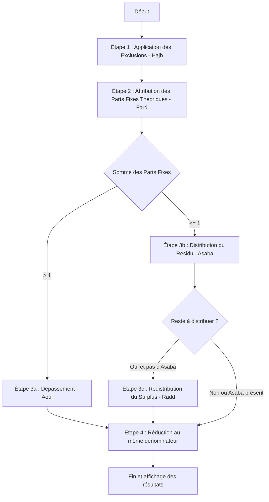

# Documentation du Calcul de l'Héritage Islamique (Ilm al-Fara'id)

Cette documentation décrit les règles juridiques et théologiques de la succession islamique (sunnite) implémentées dans l'API Frida, ainsi que l'algorithme mathématique exact utilisé pour résoudre les parts.

---

## 1. Principes Fondamentaux de la Succession Islamique

La répartition de l'héritage en droit islamique repose sur trois concepts principaux :
1. **Les Parts Fixes (*Al-Fard* / الفرض)** : Les parts explicitement définies par le Coran (1/2, 1/4, 1/8, 2/3, 1/3, 1/6) attribuées à certains héritiers sous certaines conditions.
2. **Les Résiduaires (*Al-Asaba* / العصبة)** : Les héritiers qui reçoivent le reliquat de la succession après distribution des parts fixes.
3. **L'Exclusion (*Al-Hajb* / الحجب)** : La règle selon laquelle la présence d'un héritier plus proche exclut un héritier plus éloigné du droit d'hériter.

---

## 2. L'Algorithme de Calcul en 4 Étapes

Le moteur de calcul résout la succession de manière déterministe en appliquant l'ordre suivant :

---

### Étape 1 : Les Règles d'Exclusion (*Hajb*)

Certains héritiers font écran à d'autres. Dans le périmètre de notre modèle :
*   **Le Père** exclut totalement le grand-père paternel, les frères, les sœurs, les oncles paternels et les cousins paternels.
*   **Le Grand-père paternel** (si le père n'est pas vivant) exclut totalement les frères, les sœurs, les oncles paternels et les cousins paternels.
*   **Le Fils (Garçon)** exclut totalement les frères, les sœurs, les oncles paternels et les cousins paternels.
*   **Le Frère** exclut totalement les oncles paternels et les cousins paternels.
*   **L'Oncle Paternel** exclut totalement les cousins paternels.
*   *Note* : Les filles n'excluent pas la fratrie, mais elles modifient leur statut (les sœurs peuvent devenir résiduaires avec elles).

---

### Étape 2 : Attribution des Parts Fixes (*Fard*)

Les parts de base sont calculées sur la totalité de la succession :

#### A. Conjoint
*   **Époux** (si le défunt est une femme) :
    *   **1/2** s'il n'y a pas d'enfants.
    *   **1/4** s'il y a des enfants (filles ou garçons).
*   **Épouse** (si le défunt est un homme) :
    *   **1/4** s'il n'y a pas d'enfants.
    *   **1/8** s'il y a des enfants.
    *   *Note* : S'il y a plusieurs épouses, elles partagent équitablement cette part collective (1/4 ou 1/8).

#### B. Mère
*   **1/6** s'il y a des enfants OU s'il y a au moins 2 frères/sœurs actifs.
*   **1/3** s'il n'y a pas d'enfants ET au plus un frère/sœur.
*   **Cas spécial des *Gharrawayn* (Umariyyatayn)** :
    *   Si les seuls héritiers sont : `[Conjoint, Mère, Père]` (sans enfants ni fratrie).
    *   Pour éviter que la mère ne reçoive plus que le père (ce qui contredirait le principe général), la mère reçoit **1/3 du reste** après la part du conjoint :
        *   Avec l'Époux (1/2) : La mère reçoit $1/3 \times (1 - 1/2) = 1/6$. Le père prend le reste ($1/3$).
        *   Avec l'Épouse (1/4) : La mère reçoit $1/3 \times (1 - 1/4) = 1/4$. Le père prend le reste ($1/2$).

#### C. Père
*   **1/6** (part fixe minimale) s'il y a des enfants.
*   **0** en part fixe s'il n'y a pas d'enfants (il intervient uniquement comme résiduaire *Asaba*).

#### C bis. Grand-père paternel (en l'absence du père)
*   **1/6** (part fixe minimale) s'il y a des enfants.
*   **0** en part fixe s'il n'y a pas d'enfants (il intervient uniquement comme résiduaire *Asaba*).

#### D. Filles (en l'absence de garçons)
*   **1/2** si elle est fille unique.
*   **2/3** (collectif) si elles sont plusieurs (partagée équitablement).

#### E. Sœurs (en l'absence de frères, de père et d'enfants)
*   **1/2** si elle est sœur unique.
*   **2/3** (collectif) si elles sont plusieurs.

---

### Étape 3a : Le Dépassement (*Aoul* / العول)

Lorsque la somme des parts fixes théoriques dépasse l'unité ($> 1$), le dénominateur de la succession est augmenté pour être égal à la somme des numérateurs. Cela réduit proportionnellement la part de chaque héritier.

**Exemple : Conjoint (Époux) + 2 Sœurs + Mère**
1.  Parts théoriques :
    *   Époux = $1/2$ (soit $3/6$)
    *   2 Sœurs = $2/3$ (soit $4/6$)
    *   Mère = $1/6$ (soit $1/6$)
2.  Somme des parts = $3/6 + 4/6 + 1/6 = 8/6 > 1$.
3.  Application de l'Aoul : Le dénominateur passe de $6$ à $8$.
4.  Parts finales réduites :
    *   Époux = $3/8$
    *   2 Sœurs = $4/8$ (soit $2/8$ par sœur)
    *   Mère = $1/8$
    *   *Total* = $3/8 + 4/8 + 1/8 = 8/8 = 1$.
5.  Les résiduaires (*Asaba*) reçoivent $0$.

---

### Étape 3b : Distribution du Résidu (*Asaba* / Ta'sib)

S'il reste un résidu après distribution des parts fixes ($Sum < 1$), il est attribué au groupe résiduaire prioritaire selon l'ordre suivant :

1.  **Les Enfants** (si présence de garçons) :
    *   Les garçons et filles partagent le reste avec la règle : **un garçon reçoit le double d'une fille** (ratio 2:1).
2.  **Le Père** (si aucun garçon) :
    *   Il prend l'intégralité du résidu (en plus de son $1/6$ s'il y avait des filles).
2 bis. **Le Grand-père paternel** (si aucun père ni garçon) :
    *   Il prend l'intégralité du résidu (en plus de son $1/6$ s'il y avait des filles).
3.  **La Fratrie** (si pas de père, de grand-père ni de garçons, et présence de frères) :
    *   Les frères et sœurs partagent le reste avec le ratio 2:1.
4.  **Les Sœurs avec Filles** (*Asaba ma'al Ghayr*) :
    *   En présence de filles et de sœurs (sans garçons, père ou frères), les sœurs héritent du résidu équitablement.
5.  **Les Oncles Paternels** (si pas d'Asaba plus proche) :
    *   Ils se partagent équitablement le reste.
6.  **Les Cousins Paternels** (si pas d'Asaba plus proche ni d'oncles paternels) :
    *   Ils se partagent équitablement le reste.

---

### Étape 3c : La Redistribution du Surplus (*Radd* / الرد)

S'il n'y a **aucun héritier résiduaire (Asaba)** et qu'il reste un surplus ($Sum < 1$), ce surplus est redistribué proportionnellement aux héritiers à part fixe, **à l'exclusion du conjoint** (conformément au consensus de la majorité des écoles juridiques).

La formule mathématique pour chaque héritier éligible $H_i$ est :
$$\text{Part Finale}(H_i) = \text{Part Initiale}(H_i) \times \frac{1 - \text{Part Conjoint}}{\sum \text{Parts Éligibles}}$$

**Exemple : Fille unique + Mère**
1.  Parts théoriques :
    *   Fille = $1/2$ (soit $3/6$)
    *   Mère = $1/6$ (soit $1/6$)
    *   *Somme* = $4/6 = 2/3 < 1$. Surplus = $1/3$.
2.  Pas d'Asaba présent.
3.  Application du Radd (éligibles : Fille et Mère) :
    *   Somme éligible = $1/2 + 1/6 = 2/3$.
    *   Fille obtient : $1/2 \times 1 / (2/3) = 3/4$.
    *   Mère obtient : $1/6 \times 1 / (2/3) = 1/4$.
    *   *Total* = $3/4 + 1/4 = 1$.

---

### Étape 4 : Réduction au Même Dénominateur

Pour l'affichage et la clarté du partage physique (la *Frida*), toutes les parts finales de la liste des héritiers sont converties sous un dénominateur commun (Plus Petit Multiple Commun) sans modifier leur valeur mathématique.
